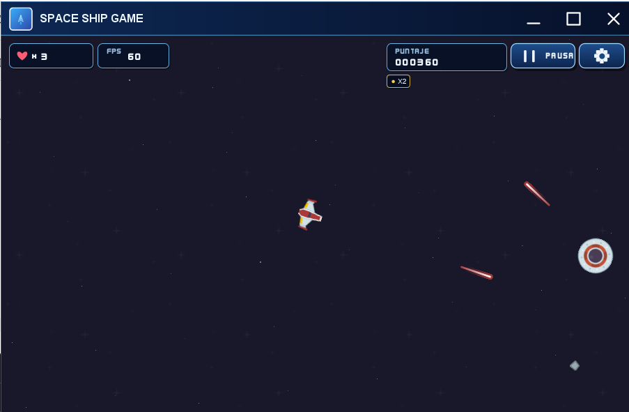
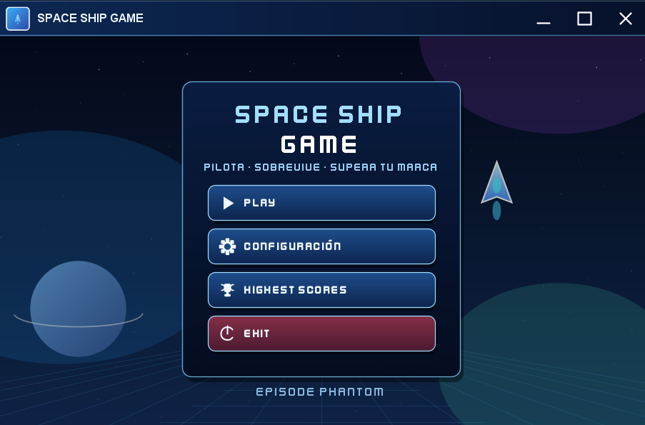
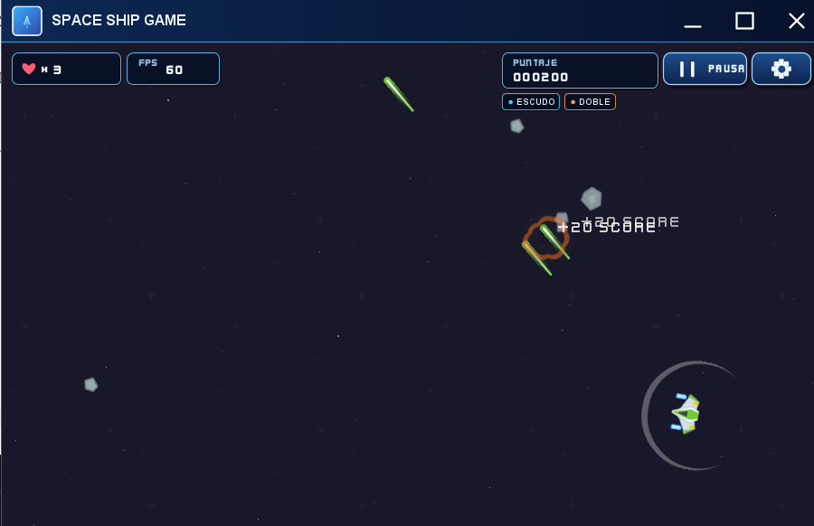
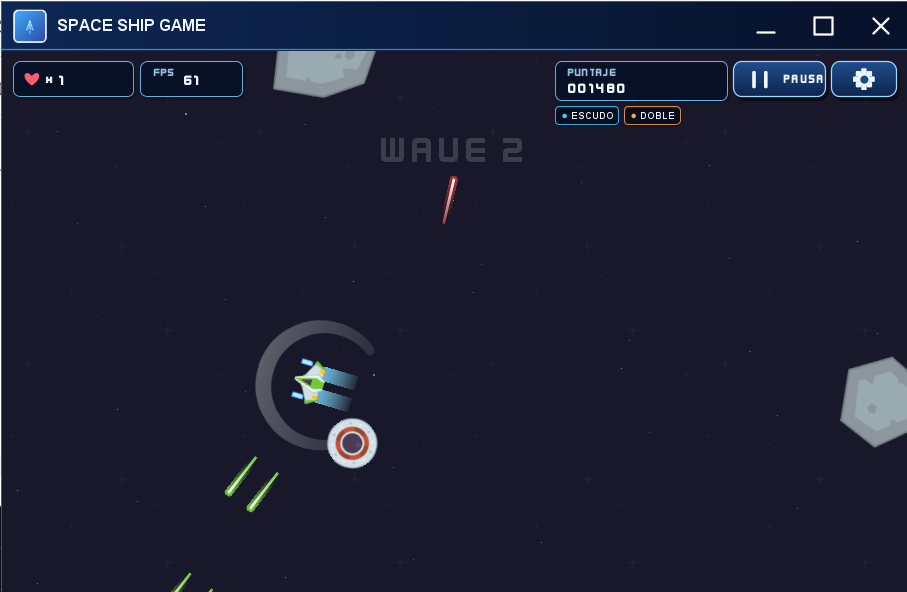

# 🚀 Space Ship


**Space Ship** es un videojuego arcade 2D de supervivencia espacial desarrollado en Java. Pilota una nave, destruye meteoritos y UFOs, recoge mejoras acumulables y alcanza la mayor puntuación posible.

> Esta edición es una **mejora independiente** basada en el repositorio [SpaceShipGame](https://github.com/JoshuaHernandezMartinez/SpaceShipGame), en particular en la implementación `Space Ship Game episode 24_final` de Joshua Hernandez Martinez. Conserva la atribución del punto de partida y amplía la experiencia con una interfaz, configuración y sistemas adicionales.

## 🎥 Demo en video

<p align="center">
  <a href="./assets/demo/space-ship-demo.mp4">
    
  </a>
</p>

<p align="center">
  <strong><a href="./assets/demo/space-ship-demo.mp4">▶ Ver demo completa en MP4</a></strong>
</p>

## 📸 Galería

<p align="center">
  
</p>

<p align="center">
  
  
  
</p>

## ✨ Características

- Menú principal, pausa, configuración, guía de controles y pantalla de Game Over.
- Ventana centrada, redimensionable y escalable sin deformar el área lógica de juego.
- Interfaz, HUD, iconos y botones dibujados con **Java2D**.
- Selección de nave —incluido el Phantom Interceptor dibujado con Java2D—, color de láser y sonido.
- Meteoritos por oleadas, UFOs, explosiones y reaparición con invulnerabilidad temporal.
- Power-ups acumulables: escudo, puntuación ×2, disparo rápido, doble cañón y vida extra.
- Tabla **Top 10** con nombre del piloto, puntaje y fecha.
- Puntajes y preferencias guardados localmente.

## 🎮 Controles

| Tecla | Acción |
|---|---|
| `W` / `↑` | Acelerar |
| `A` / `←` | Girar a la izquierda |
| `D` / `→` | Girar a la derecha |
| `Espacio` | Disparar |
| `P` / `Esc` | Pausar |

También se puede pausar o abrir la configuración desde los botones del HUD durante una partida.

## ▶️ Ejecutar

### IntelliJ IDEA

1. Abre la carpeta `space_ship` como proyecto.
2. Configura un JDK **21 o superior**.
3. Marca `src` como **Sources Root** y `resources` como **Resources Root** si IntelliJ no lo detecta automáticamente.
4. Ejecuta `src.project.Main`.

### PowerShell

```powershell
.\run.ps1
```

### JAR incluido

```powershell
java -jar .\space_ship.jar
```

Para regenerar el JAR:

```powershell
.\build-jar.ps1
```

## 📁 Estructura

```text
space_ship/
├── assets/
│   ├── demo/               # Grabación de gameplay en MP4
│   └── screenshots/        # Capturas usadas en este README
├── resources/              # Sprites, sonidos, fuentes y fondos
├── src/
│   ├── gameObjects/        # Nave, meteoritos, láseres, power-ups y UFO
│   ├── graphics/           # Animaciones, recursos, texto y sonido
│   ├── input/              # Teclado y ratón
│   ├── io/                 # Puntajes y preferencias
│   ├── math/               # Vector2D
│   ├── project/            # Ventana y estados de la aplicación
│   └── ui/                 # Componentes e interfaz Java2D
├── space_ship.jar
├── run.ps1
└── build-jar.ps1
```

## 🧩 Arquitectura

El juego utiliza un bucle de actualización y renderizado con `Canvas` y `BufferStrategy`; los estados separan el menú, la partida, la pausa, la configuración, la tabla de puntajes y Game Over. Las entidades comparten una base de objetos móviles con física vectorial, colisiones y animaciones.

## 🏆 Puntajes y preferencias

Al terminar una partida se registra el nombre del piloto y la tabla muestra los diez mejores resultados. Los datos quedan guardados fuera del repositorio, dentro del perfil local del usuario, para no mezclar puntuaciones personales con el código fuente.

## 🛠️ Tecnologías

- Java 21+
- Swing, AWT, Canvas y BufferStrategy
- Java2D y AffineTransform
- Programación orientada a objetos
- Vectores 2D, colisiones circulares y animación por frames
- Java Preferences y persistencia JSON sin dependencias externas

## 👤 Autor y créditos

**Paulo Salazar**  
Repositorio: [SalazarPaulo/space_ship](https://github.com/SalazarPaulo/space_ship)

### Proyecto de referencia

- [JoshuaHernandezMartinez/SpaceShipGame](https://github.com/JoshuaHernandezMartinez/SpaceShipGame)
- Base de referencia: `Space Ship Game episode 24_final`.
- Video de referencia: [Tutorial Java: Crear Juego De Asteroides Final](https://www.youtube.com/watch?v=Ogm2NGHd5VU).

### Recursos

Los sprites, efectos, sonidos y fuentes incluidos proceden del paquete **Space Shooter Redux** de Kenney, distribuido bajo **CC0**. Revisa [`ATTRIBUTION.md`](./ATTRIBUTION.md) y `resources/ATTRIBUTION-KENNEY-CC0.txt` para el detalle de procedencia.

---

Proyecto personal. Antes de reutilizar o distribuir código procedente del proyecto de referencia, revisa sus términos y licencia aplicables.
